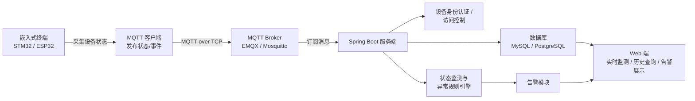

# 技术路线

## 一、总体流程

## 二、分层说明

### 1. 终端层（firmware/ + hardware/）
- 设备状态采集（如温度、电压、运行状态、心跳等）
- MQTT 客户端：发布状态消息与事件消息
- 可靠性机制：断网缓存、自动重连、数据补传
- 硬件资料：原理图、接线说明、BOM

### 2. 通信层
- MQTT Broker 部署与主题（Topic）设计
- QoS 策略、遗嘱消息（LWT）等
- 主题命名约定，例如 `device/{deviceId}/status`

### 3. 服务端（backend/）
- MQTT 接入与消息解析
- 设备身份认证 / 用户权限 / 访问控制
- 状态监测与异常规则判定
- 异常事件记录与告警触发
- 数据持久化（设备表、状态表、事件/告警表）

### 4. 展示层（frontend/）
- 设备实时状态看板
- 历史数据查询与曲线
- 异常事件与告警列表

## 三、关键技术点（待进一步确定）

| 环节 | 候选方案 | 待定项 |
|---|---|---|
| 终端 | STM32 / ESP32 | 具体型号、传感器 |
| 通信 | MQTT | Broker 选型、QoS 等级 |
| 服务端 | Spring Boot | 版本、MQTT 客户端库 |
| 数据库 | MySQL / PostgreSQL | 最终选型 |
| 前端 | 待定 | 技术栈 |
| 安全 | 设备身份 / 访问控制 | 认证方式（Token/证书等） |

## 四、实验指标与验证方法

| 指标 | 定义 | 测量方法 |
|---|---|---|
| 消息时延 | 终端发出 → Web 端可见的时间差 | 打时间戳，采集多组统计 |
| 连续上报成功率 | 成功上报条数 / 应上报条数 | 长时间连续上报统计 |
| 异常告警响应时间 | 异常发生 → 告警产生的时间差 | 注入异常场景并计时 |
| 异常/非法访问场景 | 至少一种 | 设计攻击/异常用例并验证 |

> 详细实验设计见 `docs/03-design/experiment_design.md`。
